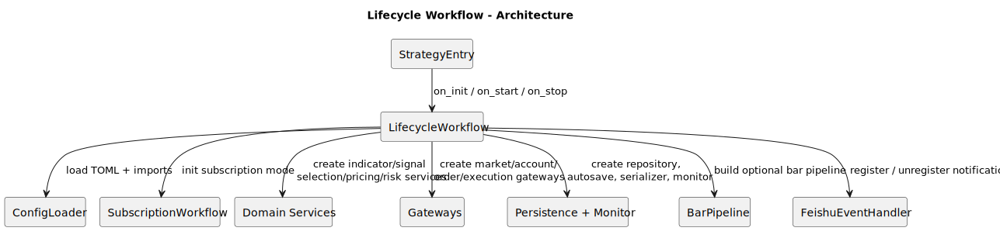
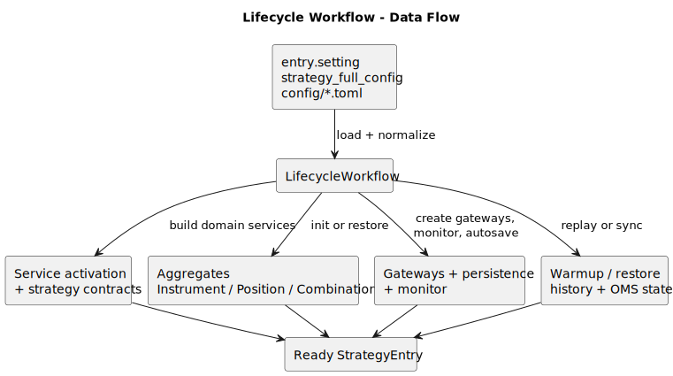
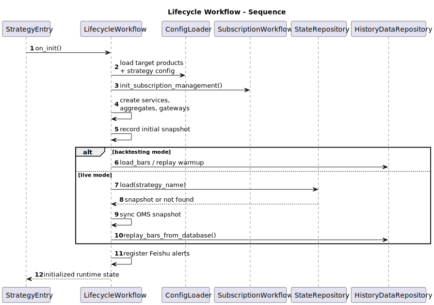
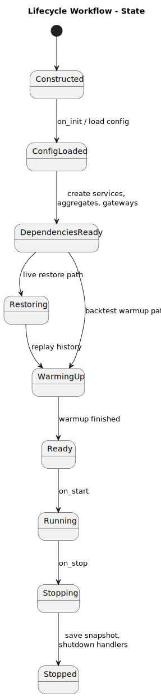

# Lifecycle Workflow

- Source: `src/strategy/application/lifecycle_workflow.py`
- Primary entrypoint: `LifecycleWorkflow.on_init`

## Responsibility

`LifecycleWorkflow` bootstraps the strategy host from configuration into a runnable process. It assembles services and infrastructure, restores or warms runtime state, and owns the transition from construction to running and finally to shutdown.

## Architecture

## Data Flow

## Sequence

## State

## Notes

- Key collaborators: `ConfigLoader`, subscription workflow delegation, domain services, gateways, persistence stack, monitor, bar pipeline, Feishu alert handler.
- Inputs: `entry.setting`, strategy TOML files, persisted snapshots, OMS state, historical bars.
- Outputs: initialized services and gateways, restored aggregates, warmed strategy state, registered alerts, saved snapshot on shutdown.
