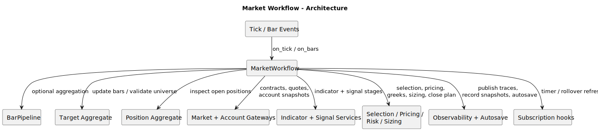
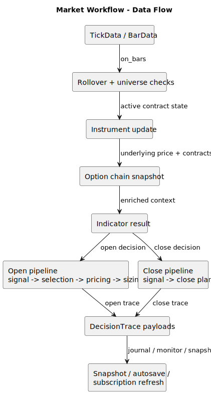
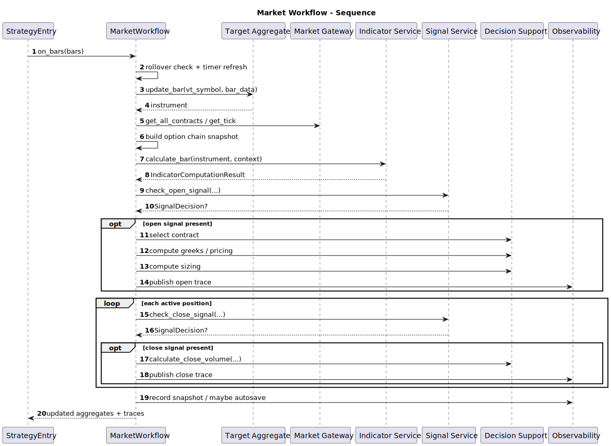

# Market Workflow

- Source: `src/strategy/application/market_workflow.py`
- Primary entrypoint: `MarketWorkflow.on_tick`

## Responsibility

`MarketWorkflow` is the main decision pipeline for incoming market events. It handles rollover checks, universe validation, indicator computation, open and close signal evaluation, option-chain enrichment, sizing, trace publication, snapshot recording, and timer-driven subscription refresh.

## Architecture

## Data Flow

## Sequence

## Notes

- Key collaborators: `BarPipeline`, target and position aggregates, market and account gateways, indicator and signal services, selection/pricing/risk/sizing helpers, observability hooks.
- Inputs: `TickData`, `BarData`, contracts and ticks, account snapshot, strategy toggles and thresholds.
- Outputs: updated instruments, `DecisionTrace` payloads, close plans, temporary subscription hints, snapshots, autosave triggers.
