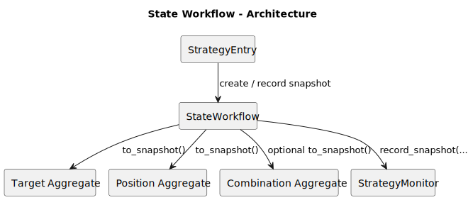
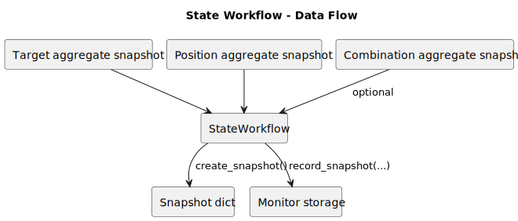
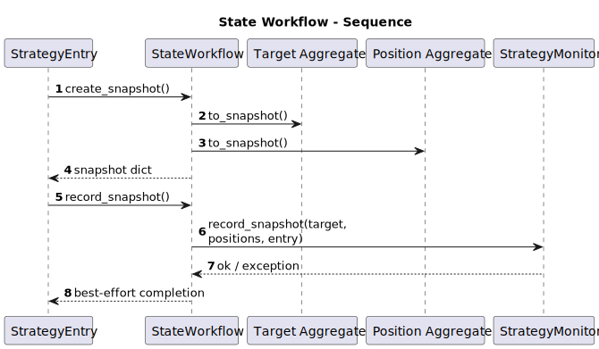

# State Workflow

- Source: `src/strategy/application/state_workflow.py`
- Primary entrypoint: `StateWorkflow.create_snapshot`

## Responsibility

`StateWorkflow` keeps snapshot structure and monitor writes out of the strategy entry class. It converts in-memory aggregates into a persistence-ready dictionary and forwards best-effort snapshot records to monitoring storage.

## Architecture

## Data Flow

## Sequence

## Notes

- Key collaborators: target aggregate, position aggregate, optional combination aggregate, monitor.
- Inputs: aggregate snapshots and `current_dt`.
- Outputs: snapshot dictionaries and optional monitor snapshot records.
