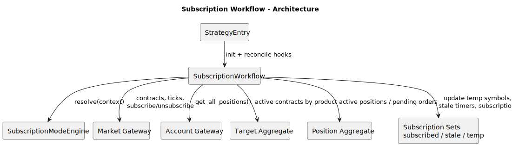
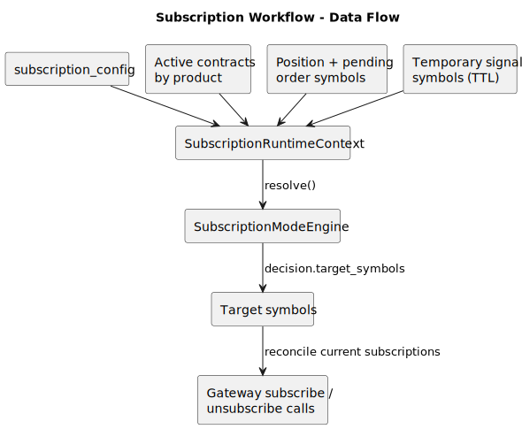
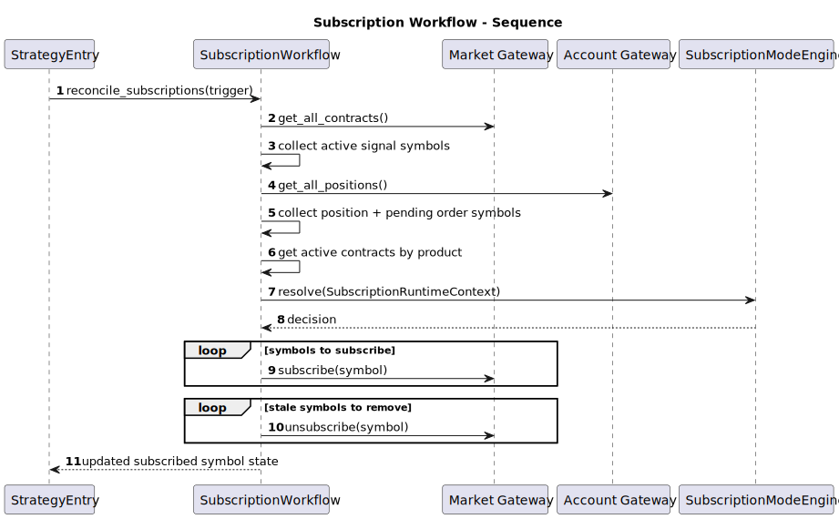
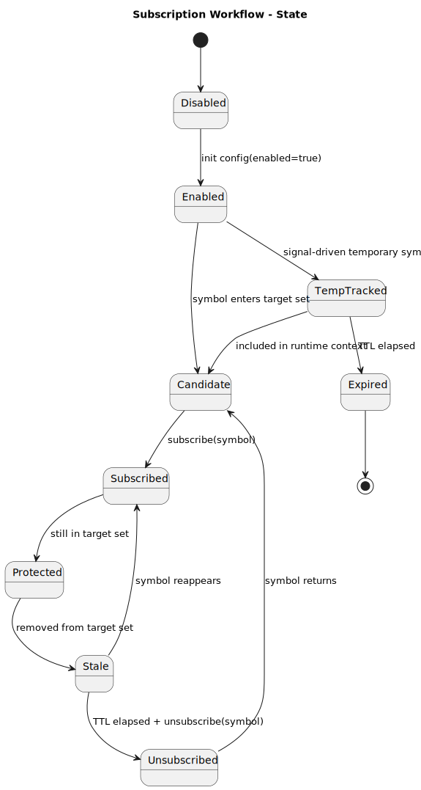

# Subscription Workflow

- Source: `src/strategy/application/subscription_workflow.py`
- Primary entrypoint: `SubscriptionWorkflow.reconcile_subscriptions`

## Responsibility

`SubscriptionWorkflow` manages market-data subscription state. It initializes subscription mode behavior, gathers symbols from positions, pending orders, active contracts, and temporary signal hints, then reconciles target subscriptions against the gateway with stale cleanup and TTL rules.

## Architecture

## Data Flow

## Sequence

## State

## Notes

- Key collaborators: `SubscriptionModeEngine`, market gateway, account gateway, target aggregate, position aggregate.
- Inputs: subscription config, current subscriptions, active contracts, positions, pending orders, temporary signal symbols, latest ticks.
- Outputs: updated subscription sets, stale timers, temporary symbol TTL state, gateway subscribe/unsubscribe calls.
